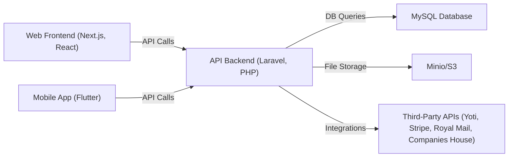
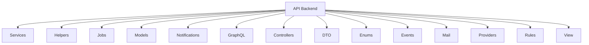
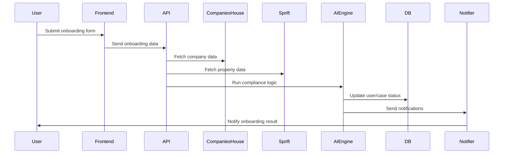
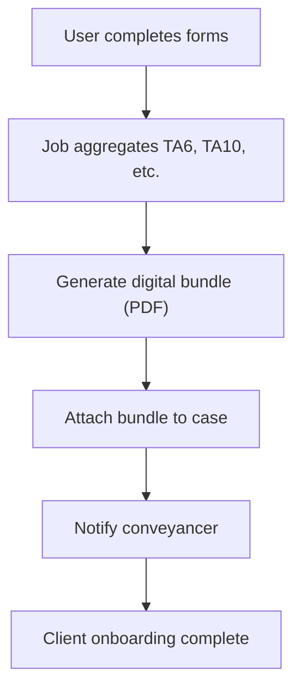
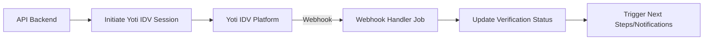
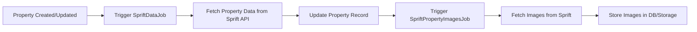
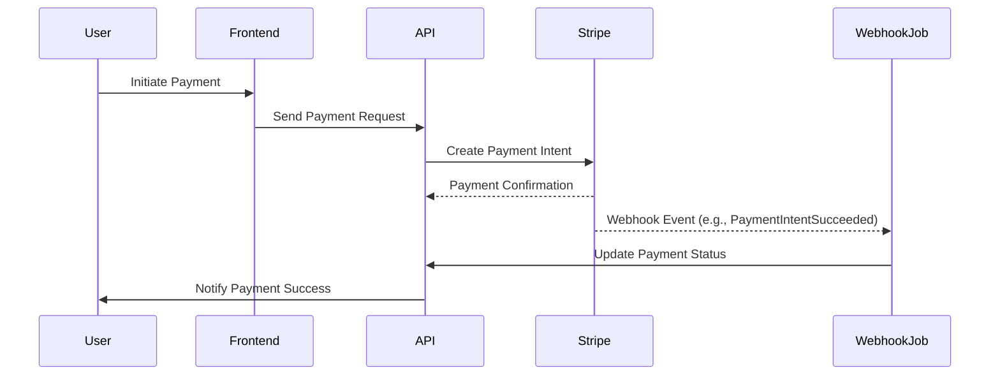
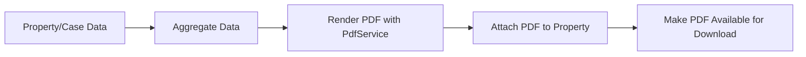
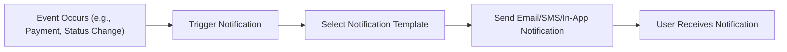
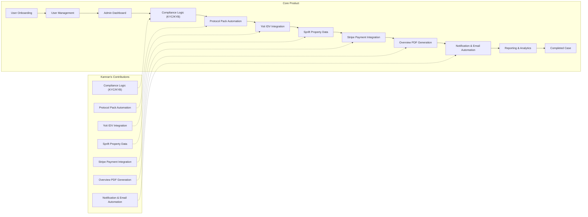

Here’s an enhanced technical contribution document for your portfolio, with more diagrams, code structure, and a grid for PR/commit stats.

---

# ProConvey: Technical Contribution

## 1. Project Overview

**ProConvey** is a legal-tech SaaS platform that digitizes and automates the UK property conveyancing process, reducing manual paperwork, improving compliance, and accelerating onboarding for conveyancers, buyers, and sellers.

### High-Level Architecture

---

## 2. Backend Structure & Code Organization

---

## 3. Features Developed & Led

### 1. AI-Driven Compliance Logic (KYC/KYB Automation)
- **Purpose:** Automates customer/business verification, reducing manual errors and speeding onboarding.
- **Importance:** Directly impacts compliance, risk, and onboarding speed; core to platform’s legal-tech value.
- **Uniqueness:** Integrates multiple APIs, applies AI/business rules, and automates legal checks.

**How it works:**
- When onboarding data is submitted, a Laravel Job is dispatched.
- The Job calls a Service to orchestrate KYC/KYB checks using third-party APIs (e.g., Companies House, Sprift).
- The Service uses Eloquent models to update user/case status based on compliance results.
- Notifications are sent to users about the outcome.
- This leverages Laravel’s jobs, services, Eloquent ORM, and notification system for robust compliance automation.

**Process Diagram:**

**Code Structure:**
- `Services/ComplianceService.php`
- `Helpers/CompaniesHouseService.php`
- `Helpers/SpriftService.php`
- `Jobs/RunComplianceCheck.php`
- `Notifications/KycResultNotification.php`

---

### 2. Protocol Pack Automation (TA6, TA10, etc.)
- **Purpose:** Aggregates legal forms into digital bundles for conveyancers.
- **Importance:** Reduces onboarding from weeks to hours, automates document handling.
- **Uniqueness:** Dynamic aggregation, PDF generation, and digital delivery.

**How it works:**
- When forms are completed, a Laravel Job is dispatched.
- The Job calls a Service to aggregate all required protocol forms (e.g., TA6, TA10).
- The Service generates a digital bundle (PDF) and attaches it to the case.
- Conveyancers are notified when the bundle is ready.
- This uses Laravel’s jobs, services, Eloquent ORM, and notification system for efficient document automation.

**Process Diagram:**

**Code Structure:**
- `GraphQL/Queries/AllDocumentsLink.php`
- `Jobs/CreateAndSendFormsToYotiJob.php`
- `Services/ProtocolFormService.php`
- `Services/PdfService.php`

---

### 3. Yoti IDV Integration (Secure Identity Verification)
- **Purpose:** Enables secure, legally binding onboarding via Yoti.
- **Importance:** Ensures compliance, reduces fraud, and streamlines user verification.
- **Uniqueness:** Real-time IDV, webhook handling, session completion automation.

**How it works:**
- When ID verification is required, the API initiates a Yoti IDV session via a Service.
- Yoti handles the user’s ID check and sends a webhook to the backend upon completion.
- A Laravel Job processes the webhook, updates verification status, and triggers further actions (e.g., document generation, notifications).
- This uses Laravel’s services, jobs, webhook handling, and Eloquent ORM for secure, automated IDV.

**Integration Flow:**

**Code Structure:**
- `Services/YotiIdvService.php`
- `Jobs/Webhooks/YotiIdv/SessionCompletionJob.php`
- `config/webhook-client.php`

---

### 4. Sprift Property Data & Images Automation
- **Purpose:** Automates property data/image retrieval for onboarding.
- **Importance:** Reduces manual entry, improves data accuracy.
- **Uniqueness:** Async jobs, API integration, dynamic property enrichment.

**How it works:**
- When a property is created or updated, a Laravel Job is dispatched.
- The Job calls a Service to fetch property data from the Sprift API.
- The Service uses Eloquent models to update the property record.
- Another Job is triggered to fetch and store property images asynchronously.
- This mechanism leverages Laravel’s queue, service, and Eloquent ORM patterns for reliability and scalability.

**Process Diagram:**

---

### 5. Stripe Payment Integration & Webhooks
- **Purpose:** Handles digital payments, webhook events, and payment status.
- **Importance:** Enables seamless payment flows, automates financial tracking.
- **Uniqueness:** Custom webhook jobs, event-driven updates.

**How it works:**
- The user initiates a payment from the frontend, which is sent to the backend API.
- The API creates a payment intent with Stripe.
- Stripe sends payment confirmation and triggers a webhook event.
- A Laravel Job processes the webhook, updating payment status in the database.
- The user is notified of payment success. This uses Laravel’s jobs, webhook handling, and notification system.

**Sequence Diagram:**

**Code Structure:**
- `config/stripe-webhooks.php`
- `Jobs/Webhooks/Stripe/PaymentIntentSucceeded.php`
- `Providers/AppServiceProvider.php`

---

### 6. Automated Overview PDF Generation
- **Purpose:** Generates summary PDFs for properties and cases.
- **Importance:** Provides legal documentation, improves client experience.
- **Uniqueness:** Dynamic data aggregation, PDF rendering, media management.

**How it works:**
- When a summary is needed, a Laravel Job is dispatched.
- The Job aggregates data from Eloquent models (property, forms, answers, etc.).
- A Service renders the PDF using the aggregated data.
- The PDF is attached to the property and made available for download.
- This uses Laravel’s jobs, services, and Eloquent ORM for data handling and document management.

**Process Diagram:**

---

### 7. Notification & Email Automation
- **Purpose:** Sends automated notifications for onboarding, document status, and payments.
- **Importance:** Keeps users informed, reduces manual follow-ups.
- **Uniqueness:** Event-driven, customizable templates.

**How it works:**
- When key events occur (e.g., payment, status change), Laravel triggers a notification.
- The notification system selects the appropriate template and delivery channel (email, SMS, in-app).
- Notifications are sent to users using Laravel’s notification and mail system.
- This approach uses Laravel’s event, notification, and mail features for robust communication.

**Process Diagram:**

---

## Linking Features to Main Product Flow

---

## Importance & Uniqueness

- Each feature is architected for scalability, compliance, and automation.
- Integrations with third-party APIs (Yoti, Stripe, Sprift, Royal Mail, Companies House) are rare in legal-tech.
- Automated document and compliance flows set ProConvey apart in the UK market.

---

## PR & Commit Stats (Grid)

| Year      | PRs Merged | Commits | Contributions |
|-----------|------------|---------|--------------|
| 2023      | 120+       | 150+    | 272          |
| 2024      | 160+       | 200+    | 421          |

**Sample PRs:**
| PR Number | Title                                      | Date         |
|-----------|--------------------------------------------|--------------|
| #1155     | Yoti IDV redirect system                   | Feb 21, 2024 |
| #861      | Automated Protocol Pack aggregation        | Jan 13, 2024 |
| #972      | Laravel jobs for Sprift property data      | Jan 26, 2024 |
| #1451     | Overview bugfixes and enhancements         | Apr 2, 2024  |

---

## 8. External Links

- [Stackademic Profile](https://stackademic.com/)
- [LinkedIn](https://www.linkedin.com/in/kamrankhalid786/)
- [ProConvey Website](https://proconvey.co.uk/)
- [GitHub Contributions 2023](https://github.com/kamrankhalid786?tab=overview&from=2023-12-01&to=2023-12-31)
- [GitHub Contributions 2024](https://github.com/kamrankhalid786?tab=overview&from=2024-12-01&to=2024-12-31)

---

**Let me know if you want more diagrams, code samples, or a deeper breakdown for any feature!**